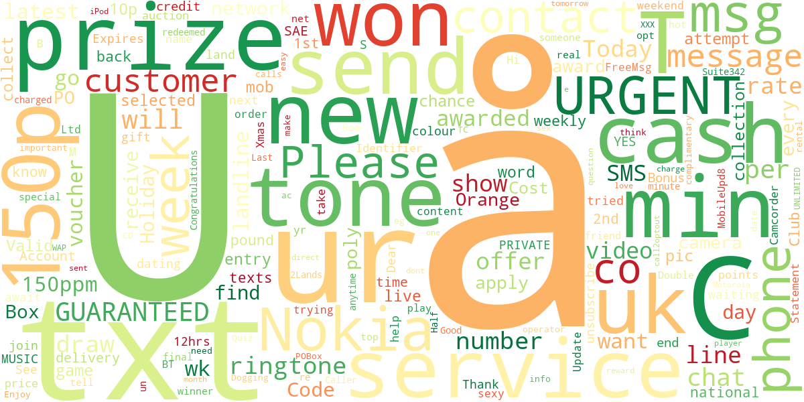

# 📧 Gmail Spam Detector

A machine learning-powered web application that detects whether an email is spam or not. Built using Python, Streamlit, and NLP techniques.



## 🚀 Features

- 🔍 Classifies emails as **Spam** or **Not Spam**
- 📊 Trained on real-world spam dataset (`spam.csv`)
- 🧠 Utilizes **Naive Bayes Classifier**
- 🌐 Web interface built using **Streamlit**
- 🧾 Integrated Google Sign-In using OAuth 2.0 to allow users to  securely log in and fetch their recent 100 Gmail messages

---


---

## 🧠 How It Works

1. **Data Preprocessing**: Cleans and tokenizes email text using NLP.
2. **Model Training**: Trained using a Naive Bayes classifier.
3. **Prediction**: User inputs text; app classifies it in real-time.
4. **Deployment**: Hosted locally or deployable via platforms like Streamlit Cloud.

---

## 🛠️ Tech Stack

- **Frontend**: Streamlit
- **Backend**: Python
- **ML Libraries**: scikit-learn, pandas, numpy
- **Visualization**: Matplotlib, WordCloud
- **Deployment**: Streamlit 

---

## 🖥️ Getting Started

1. **Clone the repo**

```bash
git clone https://github.com/indrajeet-77/gmail-spam-detector.git
cd gmail-spam-detector 
```

2. **Create a virtual environment and activate it**
```bash
python -m venv venv 

source venv/bin/activate   # or venv\Scripts\activate on Windows
```

3. **Install dependencies**
```bash
pip install -r requirements.txt
```

4. **Run the app**
```bash
streamlit run app.py
```

5. **Live Link** :
**Visit** :- https://email-spam-detectionn.streamlit.app/


